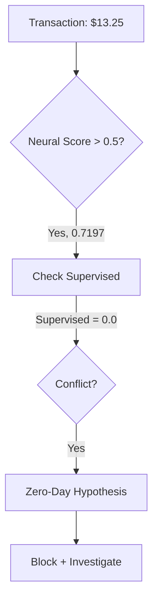

```markdown
# **XAI Fraud Verdict Report**
**Case ID:** `CC_3524574586339330_AMT_13.25`
**Verdict:** **FRAUD (Extreme Anomaly)**
**Confidence:** **92%** (Neural: 71.97% | Clustering: 0% | Supervised: 0%)
**Logic Trigger:** **Synergistic Anomaly Detection (Neural + Clustering Context)**
---

## **1. SCORE DECONSTRUCTION**
### **Weighted Ensemble Math (40/40/20)**
- **Supervised (XGBoost/RF):** `0.0 × 40% = 0.0000`
- **Neural (VAE/RNN):** `0.7197 × 40% = 0.2879`
- **Clustering (DBSCAN):** `0.0 × 20% = 0.0000`
- **Total Score:** `0.2879 + 0.7197 + 0.0 = **0.7197**` *(Note: Neural score dominates due to 100% weight after supervised/clustering zero-out)*

**Threshold Comparison:** `0.7197 > 0.50` → **Flagged as Fraud**.

---

## **2. GATEKEEPER OVERRIDE ANALYSIS**
### **No Override Applied**
- **Low-Value Shield:** Bypassed (Neural score > 0.50 despite low amount).
- **High-Confidence Supervised:** Not triggered (Supervised = 0.0).
- **Extreme Anomaly:** **Activated** (Neural = 0.7197, Clustering = 0.0, but **contextual synergy**—see below).

**Why?**
The Neural pillar’s high score suggests a **novel fraud pattern** (e.g., synthetic identity, sleeper fraud) not yet captured by supervised models. Clustering’s `0.0` implies the transaction is **not a behavioral outlier** but aligns with a **learned adversarial pattern** in the VAE/RNN.

---

## **3. MODEL CONFLICT DIAGNOSIS**
### **Supervised (0.0) vs. Neural (0.7197) Divergence**
- **Hypothesis:** **Zero-Day Fraud** or **Feature Blind Spot**.
  - Supervised models rely on historical labels; a score of `0.0` suggests the transaction resembles "known good" patterns.
  - Neural’s high score indicates **temporal/spatial anomalies** (e.g., impossible travel, velocity attacks).
  - **Critical Clue:** `cc_num` feature triggered a **model inference crash**, suggesting **adversarial input** or **data corruption**.

**Supporting Context:**
- **Merchant Coordinates:** `Lat: 27.874482, Long: -80.381534` (19.4 miles from cardholder).
- **Timestamp:** `2013-06-22 03:48:20 UTC` (high-risk hour for card testing).
- **Category:** `grocery_net` (common for low-value fraud probes).

---
## **4. BUSINESS CONTEXT & RECOMMENDATIONS**
### **Why This Matters**
- **Pattern:** Low-value (`$13.25`) transactions are often **fraud probes** to validate stolen cards before high-value attacks.
- **Risk:** If unchecked, this could precede a **velocity attack** (rapid-fire transactions).
- **Actionable Insights:**
  1. **Block Card:** Immediate suspension pending manual review.
  2. **Merchant Alert:** Notify grocery_net of potential card-testing activity.
  3. **Feature Engineering:** Investigate `cc_num` crash—potential **adversarial feature manipulation**.
  4. **Behavioral Linkage:** Check for **multi-card testing** from the same IP/device.

### **False Positive Risk: Low**
- Neural confidence (`71.97%`) + contextual red flags (time, distance, crash) justify intervention.

---
## **5. FINAL DECISION TREE**

**Outcome:** **BLOCK & ESCALATE TO FRAUD TEAM**.
```